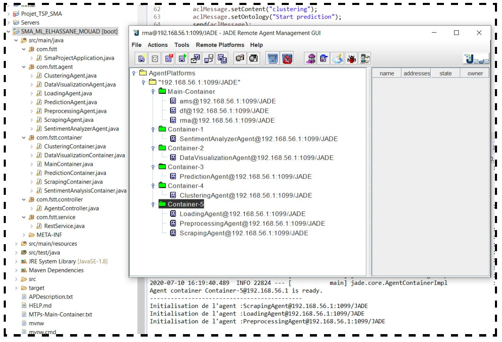
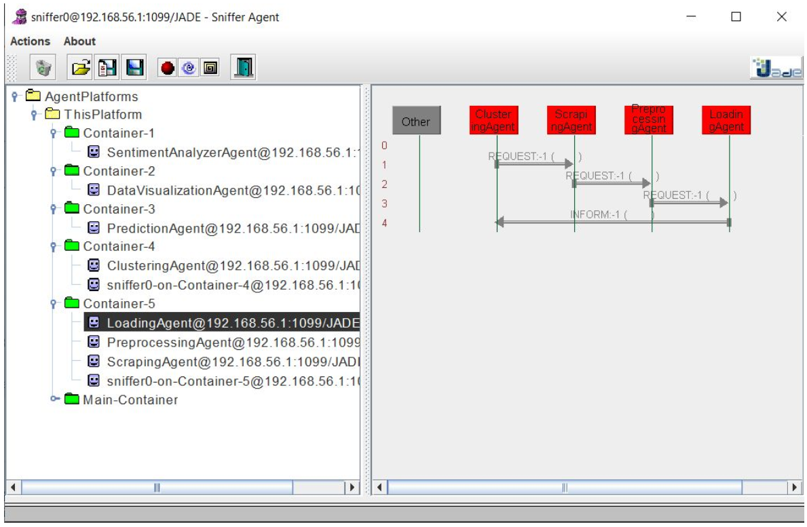
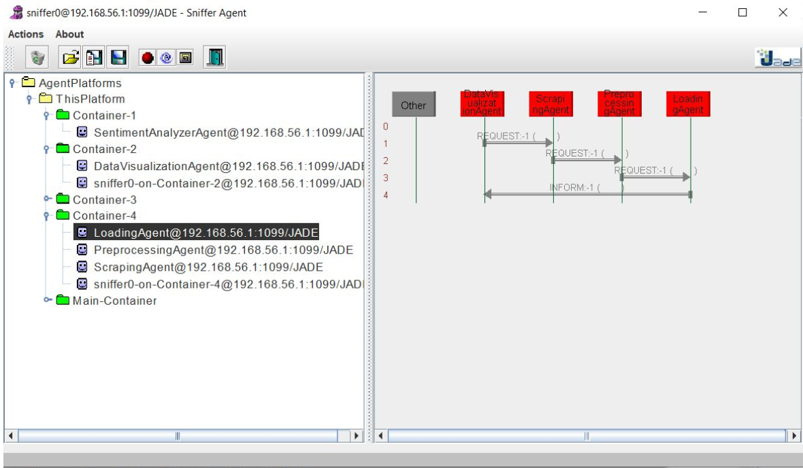

# Multi Agent System (MAS) layer 
This is a REST api based on SpringBoot containing JADE Framework with all our agents, and their behaviours and how they communicate with each other and 
how they serve the SPA frontend layer.   

## Built With
* [Spring Boot](https://spring.io/projects/spring-boot) - The web framework used to build the MAS layer API
* [JADE Framework](https://jade.tilab.com/) - The framework used to implement agents in the MAS layer

## Scraping Agents
### Scrapping agent 
An agent that handle scrapping requests comming from other agents using ACL messges. 
1- The agent starts the appropriate request in order to handle the corresponding scrapped data. 
2- The agent send a REQUEST message to Preprocessing Agent in order to start preprocessing the data. 
### Preprocessing Agent
An agent that handle preprocessing requests comming from other agents using ACL messges. 
1- The agent starts the appropriate request in order to preprocess the corresponding scrapped data. 
2- The agent send a REQUEST message to Loading Agent in order to start loading the data. 
### Loading Agents
An agent that handle loading to database requests comming from other agents using ACL messges. 
1- The agent starts the appropriate request in order to load the scrapped data to the corresponding collection in a mongodb database. 
2- The agent send an INFORM message to the corresponding agent. 

## Sentiment analysis agent
An agent that handle all the comming request concerning sentiment analysis: scrapping updated data, start analysis, providing statistics and usefull data...ect   

## Prediction agent
An agent that handle all the comming request concerning prediction: scrapping updated data, geting predictions, providing statistics and usefull data...ect   

## Clustering agent
An agent that handle all the comming request concerning clustering: scrapping updated data, geting clusters, providing statistics and usefull data...ect   

## Data visualization agennts
An agent that handle all the comming request concerning visualization: scrapping updated data, providing statistics and usefull data...ect   

## API Description 
Semilar to Smart Layer API, except this time each request is handlled by it's corresponding agent.

