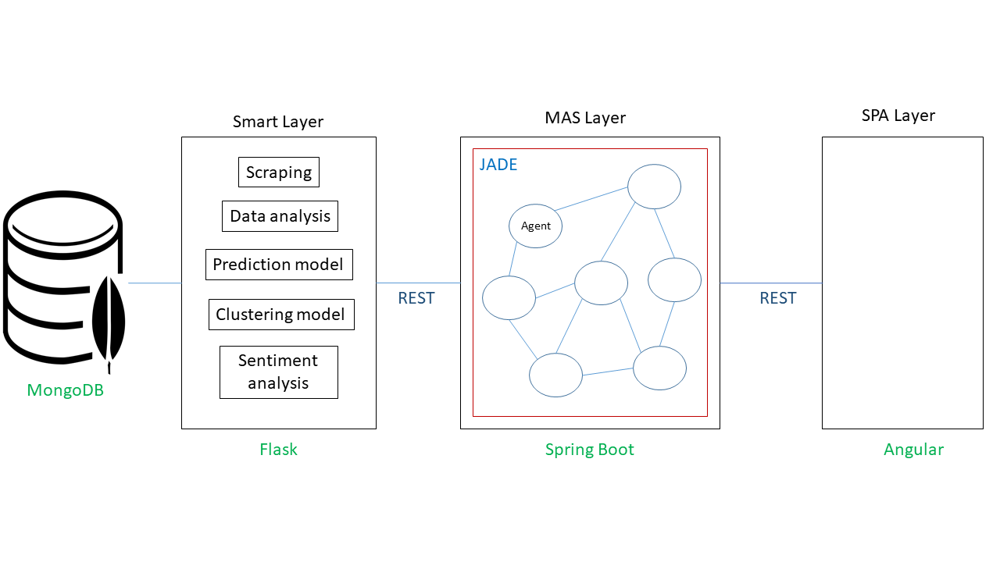

# Morocco covid-19: A machine learning and multi-agent system approach

This project is a class project (for learning purposes) as a part of Multi agents systems and Machine learning classes at The Faculty of Sciences and Technologies Tangier

## Objective

The main objective of the project is the implementation of an intelligent multi-agent system based on several supervised and unsupervised learning algorithms. The system will be composed of several intelligent and interactive agents, from which each agent performs a specific task. In addition to a Single page Application (Angular based) that will interact with the system.

## Built With
The project is built using the following Frameworks 

* [MongoDB](https://www.mongodb.com/) - The used to store data
* [Flask](https://flask.palletsprojects.com/en/1.1.x/) - The web framework used to build the smart layer API
* [Spring Boot](https://spring.io/projects/spring-boot) - The web framework used to build the MAS layer API
* [JADE Framework](https://jade.tilab.com/) - The framework used to implement agents in the MAS layer
* [Angular](https://angular.io/) - The framework used to build the front-end layer

For detailed instructions on prerequisites for each layer please read the readme.md file on each layer.

## Architecture

The project is built using a combination of restful and multi agent architechture, it consists of 3 separated layers:

### Smart layer
This is a Flask based REST api containing all the scripts needed to scraping, pre-processing and loading data into a Mongodb database in addition to all the models we have developed for clustering, predictions, sentimental analysis and visualizations.
### Multi Agent System (MAS) layer 
This is a REST api based on SpringBoot containing JADE Framework with all our agents, and their behaviours and how they communicate with each other and 
how they serve the SPA frontend layer.
### Single Page Application (SPA) layer
This is the front-end part which contains pages for each agent (clustering, predictions, sentimental analysis and data visualisation), each page communicates with it's own appropriate agent using a restful architecture.

## Authors

* **EL KTIBI El hassane** - *Smart Layer + MAS layer* - [Github](https://github.com/elhassane)
* **CHAOUKI Mouad** - *Smart Layer + Front-end* - [Github](https://github.com/MouadCh)

  
