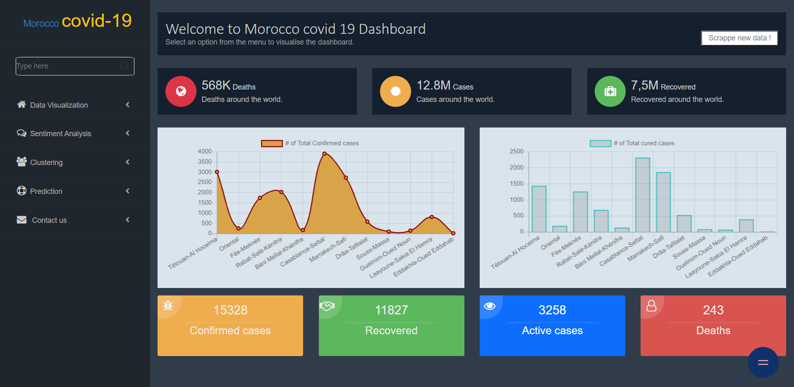
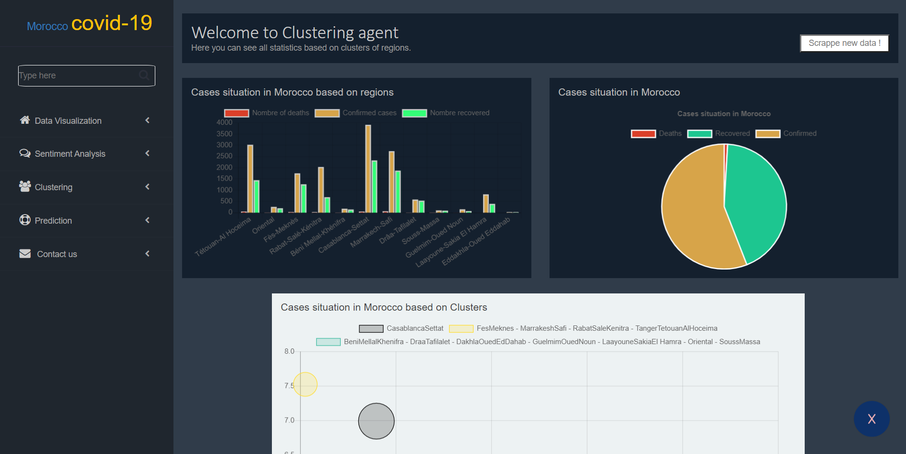
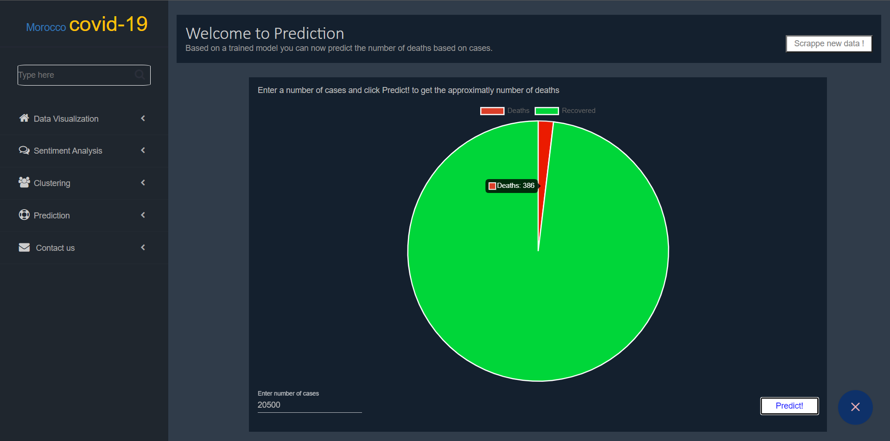
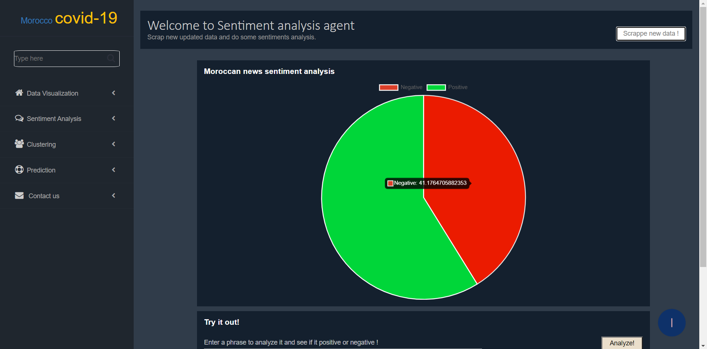

# Single Page Application (SPA) layer
This is the front-end part which contains pages for each agent (clustering, predictions, sentimental analysis and data visualisation), each page communicates with it's own appropriate agent using a Restful architecture.

## Biult using
* [Angular 8](https://angular.io/) - The framework used to build the front-end layer
* [ChartJS](https://www.chartjs.org/) - The JavaScript library for data visualization
## How to start 
To start the project please do the following commands inside the project directory: 
```
npm install 
```
or 
```
npm install --only=dev
```
start the project using
```
ng serve
```
Make sure that the Smart Layer and MAS layer are running correctly.
## Screenshots
### Data Visualization
demo of possible vusualizations. </br></br>

### Clustering
demo of possible vusualizations + regions clustering based on number of cases and deaths. </br></br>

### Prediction
Predict number of deaths based on number of cases. </br></br>

### Sentiment Analysis
Visualize moroccan sentiment analysis statistics. </br></br>
Try to do sentiment analysis on a text you choose. </br></br>
Visualize moroccan news headlines based on sentiment analysis polarity (positives or negatives). </br></br>

